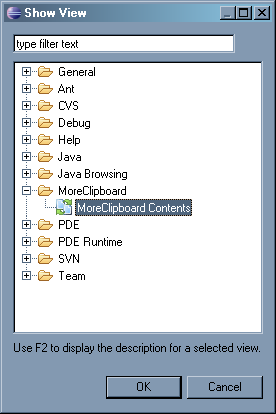
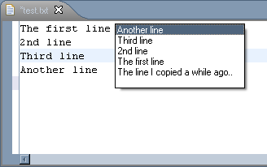

# MoreClipboard for Eclipse

More Clipboard keeps track of the latest entries copied/cut into clipboard buffer and allows quick pasting from the popup list by pressing a hotkey. Inspired by Multi Clipboard plugin for Eclipse and Visual Assist for MS VS.

# Installation

It's simple:
* Drag the Install button to your running Eclipse workspace:
<a href="http://marketplace.eclipse.org/marketplace-client-intro?mpc_install=857" class="drag" title="Drag to your running Eclipse workspace to install More Clipboard">

</a>
* OR find the plugin by name in Eclipse Marketplace Client (```Help/Eclipse Marketplace..```)
* OR add the link to [update site](https://raw.github.com/mikhail-barg/moreclipboard/master/site) to your Eclipse Update Site manager.
* OR just download the latest moreclipboard_X.Y.Z.jar file from Releases into your Eclipse ```/plugins``` folder

To check if the plugin is installed and working open ```Window/Show View/Other..``` dialog; there should be a MoreClipboard folder with a MoreClipboard Contents view.



# Setup

Since v1.2 no additional septup is needed! Plugin automatically adds bindings from new context. The bindings are as follows:
* Regular ```Ctrl+C``` (```Ctrl+Insert```) and ```Ctrl+X``` (```Shift-Delete```) - just continue working as usual Copy and Cut commands, but also store cppied text in the internal buffer. You may see it's contents in already mentioned MoreClipoard View, but it's not required.
* New ```Ctrl+Shift+V``` (```Ctrl+Shift+Insert```) bindings provide ability to paste previously copied text by opening a popup window:



* You may also use combinations ```Alt+V+1``` .. ```Alt+V+9``` to paste items from MoreClipboard by index.

As usual with Eclipse you may change key bindings via ```Window/Preferences/General/Keys```
